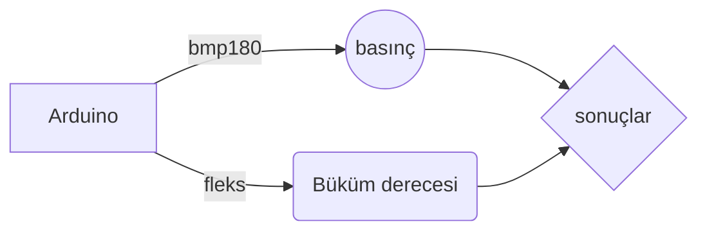

# Sanal Gerçeklik Uyumlu Akıllı Eldiven

Günümüzde sanal gerçeklik kasklarındaki yenliklere gerçek ve sanal dünyanın arasındaki fark iyice azalmıştır. Ancak sanal gerçeklikte kullandığımız kontrolcüler yüzünden insanlar VR’da kendi elleri yerine kullanılması doğal hissettirmeyen kontrolcüler kullanmaktadır. Projemiz sanal gerçeklikte kullanılabilecek bir çift eldiven ve uygulanabilir bir rehabilitasyon yazılımı geliştirmektir. Bu eldivenleri ve sanal gerçeklik kasklarını kullanarak ince motor becerilerini geri kazanabilecekleri bir sanal gerçeklik ortamı oluşturmak ve akıllı eldiven ile basit bir çözüm sağlamaktır.

# Amaç
İnce motor kaslarının gelişimini anlayabilmek için fleks sensörleri ile parmak büküm derecesini almaktayız. Objelere yapılan basıncı bmp180 sensörü üzerinden okumaktayız. Böylece elimizin hareket ve uyguladığı basıncı algılayarak doğal kontrolcü elde edebilmek.

# Sensörler
>Fleks
>Bmp180

## Çalışma Prensibi

|        Sensör  |          Amaç                 |
|----------------|-------------------------------|
|fleks       | `Parmak büküm derecesini ölçmek`  |          |
|Bmp180      |`obje basıncını ölçmek`            |

## Fleks Bacak Bağlantısı

## Bmp180 Bacak Bağlantısı

## Arduino bağlantısı
https://drive.google.com/file/d/1D6FztwYFG-8BkfcYny8YvpVDk-ou5gUI/view?usp=sharing

## Arduino kodu

    #include <Wire.h>
    #include <SFE_BMP180.h>
    SFE_BMP180 bmp180;
    
    const int FLEX_PIN = A0; 
    const float VCC = 4.98; 
    const float R_DIV = 9700; 
    const float STRAIGHT_RESISTANCE =52000; 
    const float BEND_RESISTANCE =180000; 
    void setup() 
    {
      Serial.begin(9600);
      bmp180.begin();
      pinMode(FLEX_PIN, INPUT);
    }
    void loop() 
    {
      char status;
      double T,P;
      bool success = false;
    
      int flexADC = analogRead(FLEX_PIN);
      float flexV = flexADC * VCC / 1024.0;
      float flexR = R_DIV * (VCC / flexV - 1.0);
      float angle = map(flexR, STRAIGHT_RESISTANCE, BEND_RESISTANCE,0, 90.0);
       status = bmp180.startTemperature();
      if (status != 0) {
        status = bmp180.getTemperature(T);
        if (status != 0) {
          status = bmp180.startPressure(3);
          if (status != 0) {
            status = bmp180.getPressure(P, T);}
            }
            }
      Serial.println(String(angle)+" degree "+String(P)+" hPA");
      delay(500);
      }

## Labview Front Paneli 

(https://drive.google.com/file/d/1a8m1GfpSYEIMXrGfNyRZU6_iFDUP-N_R/view?usp=sharing)

# Labview Block Diagramı

(https://drive.google.com/file/d/1kdnrFIy11vacxkoZHdMA6nYIQtkMTgq2/view?usp=sharing)

